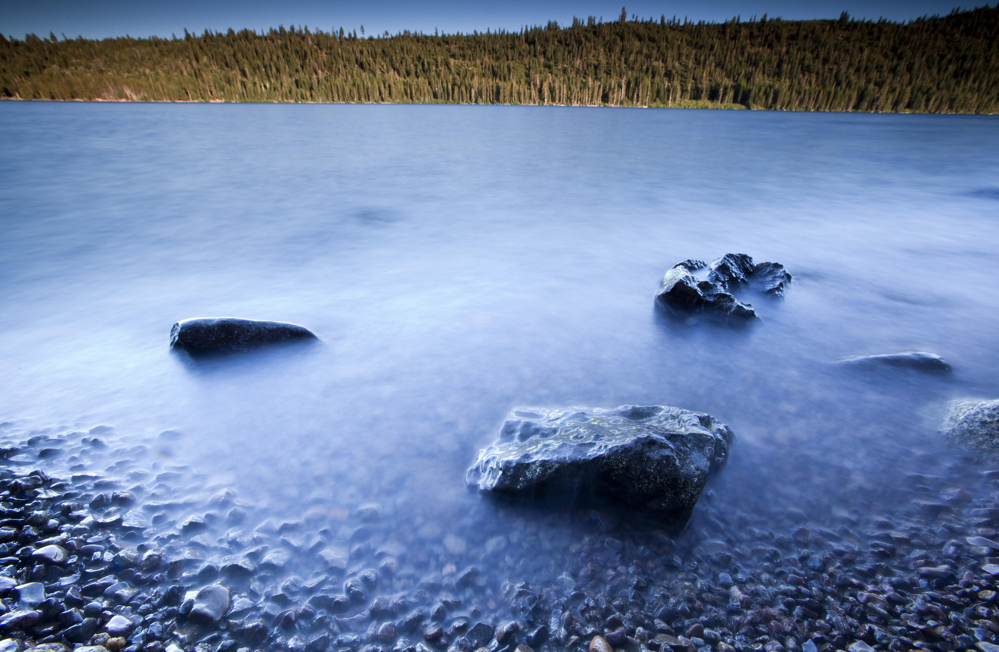
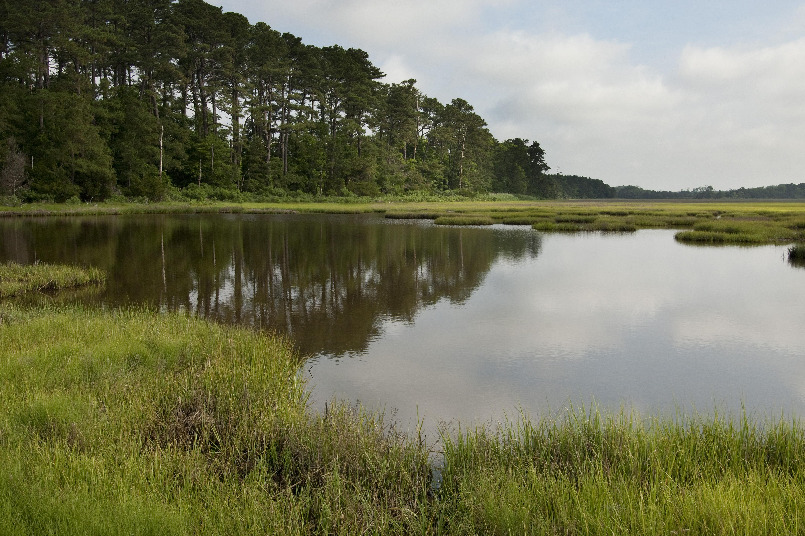

### This page:
+ Short introduction to the Conservancy's LANDFIRE program
+ Description of the Biophysical Settings (BpS), plus reference conditions delivered in the BpS descriptions and models
+ Discussion of application scale

## LANDFIRE
In 2004 [LANDFIRE](https://www.landfire.gov/){target='blank'} was created. LANDFIRE is a multi-partner program that *"provides 20+ national geo-spatial layers (e.g. vegetation, fuel, disturbance, etc.), databases, and ecological models that are available to the public for the US and insular areas".*  

<style>
div.blue { background-color:#E4EEF4; border-radius: 5px; padding: 20px;}
</style>
<div class = "blue">
### LANDFIRE Biophysical Settings
**[LANDFIRE BpS](https://www.landfire.gov/bps.php){target='blank'}** represent vegetation that may have been dominant on the landscape just prior to Euro-American settlement. They are based on [NatureServe's Ecological Systems](https://www.natureserve.org/conservation-tools/terrestrial-ecological-systems-united-states){target='blank'}. 
**Biophysical Settings** are mapped (for more information on the spatial data visit [this site](https://www.landfire.gov/bps.php){target='blank'}), described below, and modeled using SyncroSim.  

The **descriptions and models** are the focus of our work here.
</div>
<br>

### Reference conditions

```{=html}
<style type="text/css">
  .figure {
    float: right;
    width: 65%;
    padding: 10px;
    text-align: center;
  }
</style>
```


```{r, echo=FALSE, fig.cap = "Photo: © Ian Shive, TNC, \n Independence Lake, Nevada"} 


```

<br>
Understanding how ecosystems looked and worked prior to Euro-American settlement is a focus of the BpS body of work. The process was to:

1. **Classify and define the ecosystems.** LANDFIRE calls the historic ecosystems "Biophysical Settings", and used [NatureServe's Ecological Systems](https://www.natureserve.org/conservation-tools/terrestrial-ecological-systems-united-states){target='blank'}

2. The LANDFIRE team held expert workshops to:
    * **Describe the BpSs**, including their nested **[succession classes](https://www.landfire.gov/sclass.php){target='blank'},** up to 5 for each BpS including their canopy height, composition and percent cover. 
    * **Use state and transition modeling techniques** to get an estimate of how much of each succession class would have been on the landscape historically, (prior to Euro-American settlement). Boxes represent state classes of vegetation condition and the arrows represent the transition from one state class to another, these are assigned probabilities to simulate future conditions.The estimated amount of each succession class depends on the natural disturbance regimes that the experts input into SyncroSim (just like you will be doing soon!).
    
From 2015 to 2019, the Conservancy's LANDFIRE team led a review of the models that resulted in updating content for over 300 of them.

<br>

#### Descriptions
Each BpS has an [extensive description](http://landfirereview.org/search.php){target='blank'}. See the description from the [Inter-Mountain Basins Montane Sagebrush Steppe Ecosystem](http://landfirereview.org/search.php?q=Montane%20Sage%20Steppe&hPP=20&idx=lf_landfire_dev&p=0&is_v=1){target='blank'} example. Each description includes:

<style>
  .col2 {
    columns: 2 200px;         /* number of columns and width in pixels*/
    -webkit-columns: 2 200px; /* chrome, safari */
    -moz-columns: 2 200px;    /* firefox */
  }

</style>


<div class="col2">
* Biophysical setting name and number
* A list of map zones the description covers
* Descriptive geographic range text
* Biophysical site description
* Disturbance description
* Descriptions of each succession class
* Relevant literature

</div>
 <br>

#### Models

Models include the information contained in the SyncroSim library. Downloading and running the BpS models using the SyncroSim software gives users immediate access to over 900 models that were created by experts in collaboration with LANDFIRE. We used a standardized set of disturbances, but the optional types allowed for other disturbances to be modeled. 

<center>
```{r, echo=FALSE, out.width= "75%"} 


```

Photo: © Mark Godfrey, TNC, Virginia Coast Reserve
</center>
<br>

### Application scale of the models

Importantly, these models and descriptions were designed for use over large areas - not your back yard. BpS models were developed for use at the [National Land Cover Database Map Zone](https://data.fs.usda.gov/geodata/rastergateway/treecanopycover/docs/partitioning-us-into-mapping-zones.pdf){target='blank'} level (hundreds of thousands of acres - see [Get Models](./GetModels.html){target='blank'}). That said, people do use them for smaller areas. Success of downscaling depends on factors such as:

+ How much review, and how comfortable are users with the information included in the models?
+ How important are the decisions and how much risk is involved?
+ How much supporting information is there?
<br>

### For more information
*  [Watch an introduction to SyncroSim](https://www.youtube.com/watch?v=e1BBcbImrrM&list=PLDFF9036BBFE46CE6&index=6&t=0s){target='blank'} Note: some features of SyncroSim may be different than what you see in the video due to versioning.

____________

#### What's next?
+ [locate](./GetModels.html){target='blank'}, download, import a model
+ make sense of the parts of model description