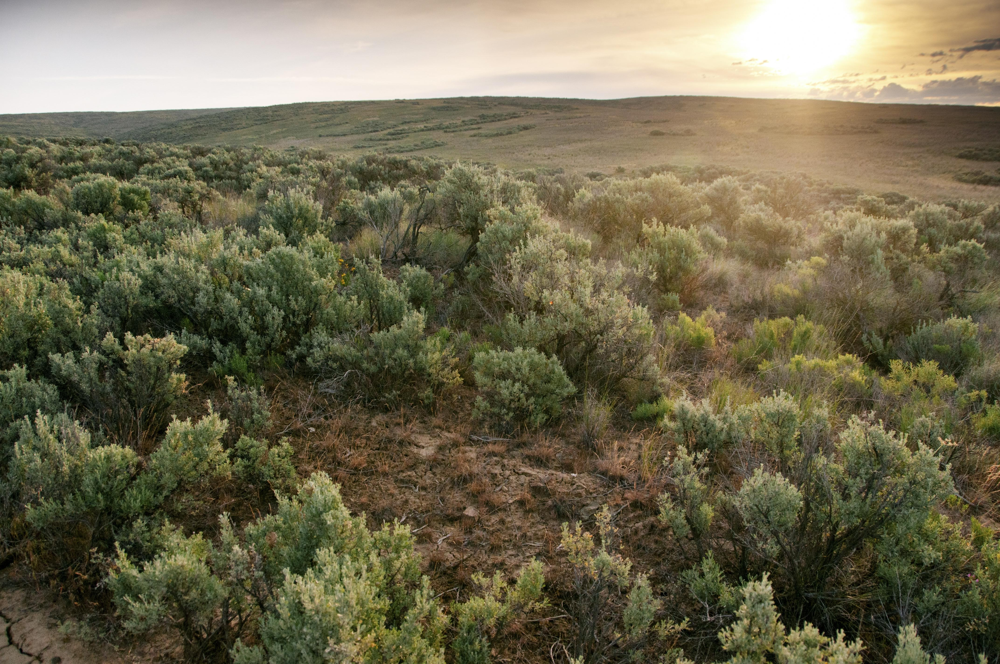
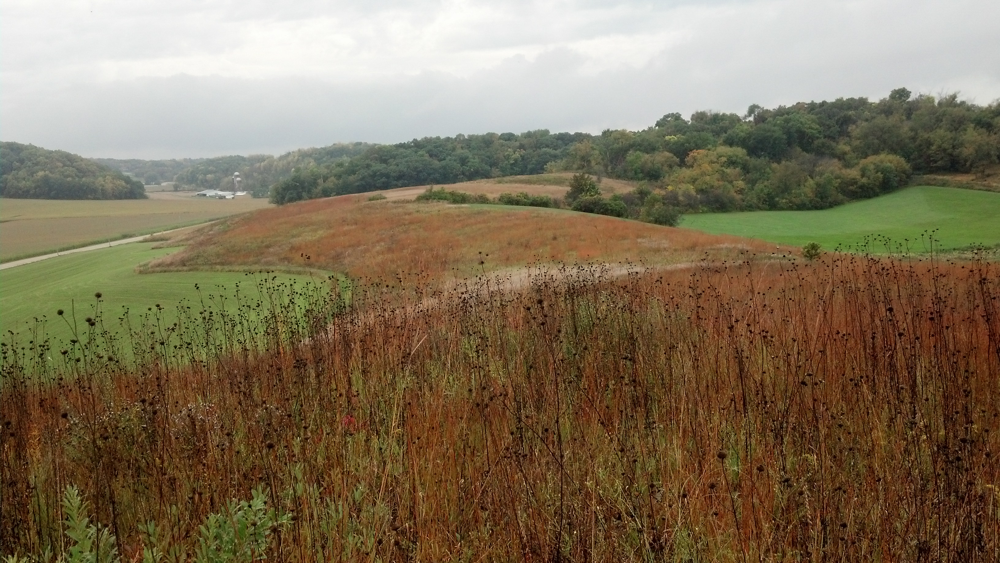
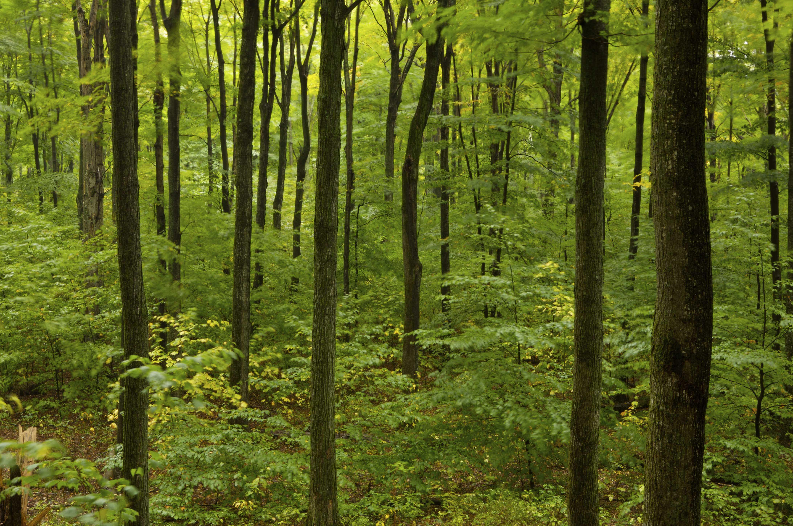

### This page:
+ See examples of how to modernize three BpS models, with a focus on the Inter-Mountain Basins Montane Sagebrush Steppe
+ Explore example models--then ask yourself "did they do a good job?"

## Context
The models below are example models aimed at illustrating modification methods. They are not intended to be realistic ecological models, rather we provide them for illustration purposes. We hope that users will primarily use our models to learn, but also assume some people could be tempted to use them as “starter models”. We’d rather they not do that as we are not experts in the actual ecosystems. We hope they serve to say "wow, these models are highly customizable".

## As you explore these models

Consider the following:

* Do these model modifications apply to my ecosystems?
* Could there be unintended consequences from these changes that trickle through the model?
* Do these modifications make the model more "realistic" or do they more serve to document new transitions that need more research?

## Examples from the field

<br>

### Example 1: Inter-Mountain Basins Montane Sagebrush Steppe 
Note: This is the example that has been used throughout the website

By: Kori Blankenship, [Download Kori's notes here](https://tnc.box.com/s/ah8wy1p79ords5rl1esf74k0raxh6ivx){target='blank'}
By: Jim Smith
```{=html}
<style type="text/css">
  .figure {
    float: right;
    width: 65%;
    padding: 10px;
    text-align: center;
  }
</style>
```

```{r, echo=FALSE, fig.cap="Photo: © Hannah Letinich, TNC. Beezley Hills Preserve, Moses Coulee, Washington"} 


```


**Model Identifier**
This model is based on the LANDFIRE 11260_1_7_8_9_10_19 BpS model and description and was modified based on several sources to represent current conditions. The primary source was the unpublished “Mountain Big Sagebrush – With Juniper” model created by Miles Hemstrom for the Blue Mountains. 

**Original Model Description**
The Inter-Mountain Basins Montane Sagebrush Steppe is found on moderately to deep soils that are well drained and predominantly Mollisols across the northwestern US. It typically occurs as elevations ranging from 3,250 to 10,000ft depending partially on the geography.
Mountain big sagebrush (_Artemisia tridentata_ spp. vaseyana) is the dominant big sagebrush subspecies. Other indicator species include antelope bitterbrush, Idaho fescue, rough fescue, bluebunch wheatgrass, Columbia needlegrass and Sandberg bluegrass.

**Modification Goal**
Represent current conditions in the Blue Mountains ecoregion including the impacts of exotic species, juniper encroachment, altered fire regimes, and livestock grazing. 

**Model Modification Steps**
(note: explanations for each one below are available [here](https://tnc.box.com/s/ah8wy1p79ords5rl1esf74k0raxh6ivx){target='blank'})

* Added three new states to represent invasion of juniper into sagebrush and the presence of invasive annual grasses with and without tress. 
* Added 4 new transitions:
    *	**Encroachment** represents juniper encroachment into the late seral native shrubland
    *	**Grazing** represents the impact of moderate livestock grazing and does not cause a state change
    *	**GrazeDegrade** represents the combined effects of heavy livestock grazing within two years post-fire disturbance which causes a transition to an exotic state
    *	**Recovery** represents natural recovery of native vegetation from exotic vegetation
* Added new transitions to and from the new states
* Added mixed fire to native sage states
* Updated replacement fire probabilities
* Used initial conditions based on LANDFIRE 2014 succession class data
* Adjusted the Run and Time Since Transition settings

***

### Example 2: Central Mixed Grass Prairie

By: Jim Smith
```{=html}
<style type="text/css">
  .figure {
    float: right;
    width: 65%;
    padding: 10px;
    text-align: center;
  }
</style>
```

```{r, echo=FALSE, fig.cap="Photo: © Jim Smith, TNC. Black Earth Prarie, Wisconsin"} 


```


**Model Identifier**
Note that the modifications illustrated in this example were applied to a locally-modified LANDFIRE BpS model 11320_32_34_35-Central Mixed Grass Prairie . You do not have to begin the modification process with a LANDFIRE model. You can utilize any model that serves as a useful starting point for your project.

**Original Model Description**
This type occurs on sandy loam, loamy, or clayey upland sites of the southern Great Plains. It is dominated by midgrasses with some mix of tall and short grass.  

**Modification Goal**
Investigate how grazing management may have changed landscape conditions since pre-European settlement. 

**Model Modification Steps**

* Adjust Run Parameters  
    * The locally modified LANDFIRE BpS model used as a starter model for this example had 0% pixels in Early Open class so we used 1% (100 acres) as the initial condition for this class and lowered the highest class by 1% to keep the total at 100%. This change is not required but is a standard practice in LANDFIRE to make certain every described Succession Class is represented in the model runs.
    * Changed number of iterations to 5 to increase turnaround time for runs, but would likely increase that number to 10 or more operationally.
    * Changed the number of cells to 10,000 and cell size to 1 acre to represent a 10,000-acre landscape. 
* Altered transitions
    * Added a prairie Restoration treatment transition to the Late 3 All state class to represent restarting overgrazed lands at the Early Open regeneration succession state using management techniques such as plowing, seeding, fertilizing, etc. Budget constrains this treatment to a 5% frequency.
    * Added a Livestock grazing transition to the Late 2 Closed state class that moves pixels to the Late 3 All state class at 10% frequency. This transition represents overgrazing a mature prairie. 
    * Added a Livestock grazing transition to the Late 1 Closed state class that moves pixels to the Late 3 All state class at a lower frequency (5%) because the Late 1 Closed state is more difficult to overgraze. This transition represents overgrazing a mature prairie. 
    * Added a Livestock Grazing transition to the Late 3 All overgrazed succession state that maintains that succession state by continuing to overgraze at a frequency of 20%. 

***

### Example 3: Laurentian-Acadian Northern Hardwoods Forest - Hemlock 

By: Randy Swaty
```{=html}
<style type="text/css">
  .figure {
    float: right;
    width: 65%;
    padding: 10px;
    text-align: center;
  }
</style>
```

```{r, echo=FALSE, fig.cap="Photo: © A. Blake Bardner, TNC. Young forest in TNC's Campbell Parcel, Equinox Highlands, Vermont"} 


```

**Model Identifier**
The starter model for this example was 13021_41_50_51, the Laurentian-Acadian Northern Hardwoods Forest - Hemlock that occurs in Minnesota, Wisconsin and Michigan.  

**Original Model Description**
These uneven-aged forests occur on coarse-textured ground and end moraines lying predominantly north of the tension zone and were dominated by a mix of sugar maple, hemlock, yellow birch, eastern white pine, balsam fir, quaking aspen and paper birch depending on the location (e.g., beech is restricted to eastern part of the range).  

**Modification Goal**
Explore how current threats such as beech bark disease and management impacts this ecosystem.  

**Model Modification Steps**

* Added 2 new states
    * "Maple Monoculture"
    * Beech  resprout
* Added new transitions
    * single tree selection–leads to maple monoculture
    * clearcut
    * deer
    * beech bark disease
    * ecological harvest 
* Set initial conditions to match current dominance by the Maple Monoculture class

***
#### What's next?
+ [Resources & FAQs](./contactsResources.html){target='blank'}
+ [References](./References.html){target='blank'}

