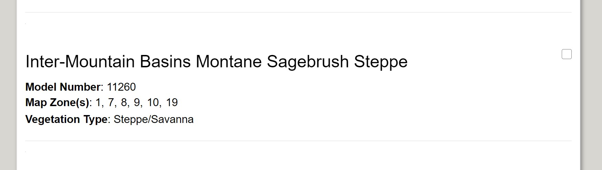

***

### This page:
* Get a description and model by:
    + Understanding and finding your Map Zone
    + Downloading a BpS description
    + [Isolate and loading your model](./isolateLoadModel.pdf){target='blank'} into SyncroSim
* Modifying reference condition models in Syncrosim
    + Change probabilities
    + Change disturbances
    + Add or delete a state or disturbance

***

We will walk through the process with the **Inter-Mountain Basins Montane Sagebrush Steppe** Biophysical Setting of the northwestern United States. This ecosystem will be the subject of later tutorials. 


## Understand and find your Map Zone

There are hundreds of Biophysical Settings in the U.S., and some of them occur in more than one Map Zone. A Map Zone is a product delivery and summary polygon from the [National Landcover Database Program](https://www.mrlc.gov/national-land-cover-database-nlcd-2016){target='blank'}.  

In the map below, pan, zoom, scroll to your area of interest, then hover over the Map Zone you need the number for. A tooltip will pop up with that info. Take note of it for the next step. 

**For the Inter-Mountain Basins Montane Sagebrush Steppe example, scroll to eastern Oregon, Map Zone 9.**

<br>

```{r echo=FALSE, message=FALSE, warning=FALSE}
htmltools::tags$iframe(title = "My embedded document", src = "leafletSIM2carto.html", frameborder = "0", width = "100%", height="400")
```

<br>

## Download a BpS Description
Visit the [LANDFIRE BpS Download](http://landfirereview.org/search.php){target='blank'} to search for and retrieve LANDFIRE BpS models and descriptions. Download the [Inter-Mountain Basins Montane Sagebrush Steppe description](http://landfirereview.org/search.php?q=Inter-Mountain%20Basins%20Montane%20Sagebrush%20Steppe&hPP=20&idx=lf_landfire_dev&p=0&is_v=1){target='blank'} for Map Zones 1, 7, 8, 9, 10, 19. Note: selecting "Map Zones" on left panel at above link will shorten the search list. 
<br>
<br>

<center>
```{r, echo=FALSE, out.width= "85%"} 


```

Correct Inter-Mountain Basins Montane Sagebrush Steppe BpS model and description.
</center>
<br>
<br>


## Isolate and load your model
Once you have SyncroSim installed [(see Vegetation Modeling)](./VegetationModeling.html){target='blank'} and both ST-Sim and lfvegmodels packages loaded, you will want to isolate one (of the ~ 900) BpS models to work with. The lfvegmodels package loads all of the models into your SyncroSim environment -- you do not need to work with all 900 models (though that is possible)!

<br>

<style>
div.blue { background-color:#cde6c8; border-radius: 5px; padding: 20px;}
</style>
<div class = "blue">
<center> 

 <font size="4">
**[Instructions for isolating and loading a single BpS model](./isolateLoadModel.pdf){target='blank'}.**
</font> 
 </center> 

</div>
<br>


## Modifying a reference condition model
Within SyncroSim there are a wide range of techniques available to modify a model. Here we introduce the main ways for modifying a model while working through the Inter-Mountain Basins Montane Sagebrush Steppe example.  

1. Feel ready to start tinkering with the model? Read on. 
2. Feel unsure and need more guidance? See this [extensive list](http://www.apexrms.com/tutorials/){target='blank'} of tutorial from ApexRMS.
<br>
<br>

### Change the probability of a disturbance in one state class
A key starting point in modifying a model is to **change disturbances**. There are multiple methods for this including changing them one at a time, per state class. Here we will show you how to change the replacement fire probability in one class. 

Download Video 1 script for printing [here.](scripts/video1oneDist.pdf){target='blank'}

To make any of the videos below larger, click play and select full screen view (bottom right corner).   
<br>

<center>
<iframe width="896" height="504" src="https://www.youtube.com/embed/GxxeSp0mzvA" frameborder="0" allow="accelerometer; autoplay; encrypted-media; gyroscope; picture-in-picture" allowfullscreen></iframe>
</center>
<br>
<br>

### Change the probability of a disturbance across the entire model
While getting to know your models we recommend changing one parameter at a time. This will allow you to get a feel for how it works, and for the sensitivities to adjust to various changes. That said, there are times where you may make "global" changes to the model. For example, you may "turn off" all fires as a way to explore impacts of fire suppression. Or, you may not have perfect fire suppression, but suppress 90% of all fires. Instead of changing one fire transition at a time we will show you how to use **transition multipliers** to modify a type of transition everywhere it occurs in the model in a few easy steps. 

Download Video 2 script for printing [here.](scripts/video2changeTransAcrossBpS.pdf){target='blank'} 
<br>

<center>
<iframe width="896" height="504" src="https://www.youtube.com/embed/75PogiK56GU" frameborder="0" allow="accelerometer; autoplay; encrypted-media; gyroscope; picture-in-picture" allowfullscreen></iframe>
</center>
<br>
<br>

### Introduce a new disturbance
There are many new transitions on the landscape today including exotic pests, multiple types of logging and tree planting. Here we will show you how to add in a new **probabilistic transition**. 

Download Video 3 script for printing [here.](scripts/video3newdisturbance.pdf){target='blank'} 
<br>

<center>
<iframe width="896" height="504" src="https://www.youtube.com/embed/YgTCwCabojo" frameborder="0" allow="accelerometer; autoplay; encrypted-media; gyroscope; picture-in-picture" allowfullscreen></iframe>
</center>
<br>
<br>

### Add a new state 
New and/or altered transitions often result in **new states**. For example, in the Great Lakes combinations of modern transitions have resulted in what some call "maple monocultures". These are forests that would typically have 5+ species represented, but now generally have one, sugar maple. Here we demonstrate how to **add a state**.

Download Video 4 script for printing [here.](scripts/video4newState.pdf){target='blank'}
<br>

<center>
<iframe width="896" height="504" src="https://www.youtube.com/embed/-EbW8vAg_bg" frameborder="0" allow="accelerometer; autoplay; encrypted-media; gyroscope; picture-in-picture" allowfullscreen></iframe>
</center>
<br>
<br>

### Delete a state
Occasionally, because of natural factors (e.g., an exotic pest) or user error you may want to **delete an entire state**. Here we will show you how to do that. 

Download Video 5 script for printing [here.](scripts/video5deleteState.pdf){target='blank'}  
<br>
<center>
<iframe width="896" height="504" src="https://www.youtube.com/embed/Z9O3VHv0Vs8" frameborder="0" allow="accelerometer; autoplay; encrypted-media; gyroscope; picture-in-picture" allowfullscreen></iframe>
</center>


***

#### What's next?
+ learn about the capability of ST-Sim to incorporate [variability and limits](./advancedModeling.html){target='blank'} into BpS models
+ dive into the complexities of using spatial models

<div class="tocify-extend-page" data-unique="tocify-extend-page" style="height: 0;"></div>