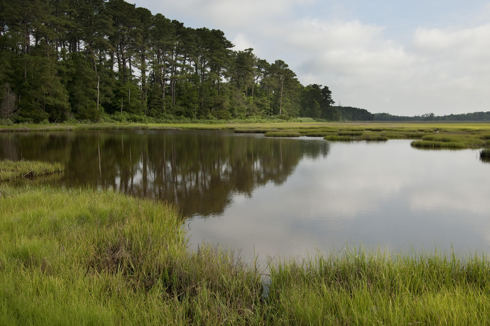

***

### This page:
+ Introduction to state-and-transition simulation (STSM) and LANDFIRE biophysical settings (BpS) models
+ BpS Description and explanation 
+ Application scale of the models 
+ Getting started with [SyncroSim](https://syncrosim.com/){target='blank'}


***

## State-and-transition models

A **state-and-transition model** (STM) conceptualizes vegetation in terms of discrete states and the transitions or pathways between them [(Westoby 1989)](http://rangelandarchive.ucdavis.edu/files/187350.pdf){target='blank'}. States are often used to represent discrete development (seral) stages, and transitions may represent disturbances such as hurricanes, fire, or grazing, but can also represent management actions such as thinning, livestock management, or herbicide application. 

## State-and-transition _simulation_ model

When a STM is built in a software environment with rates of growth between states and probabilities for each transition, it is known as a **state-and-transition simulation model** (STSM; [Daniel et al. 2016](https://besjournals.onlinelibrary.wiley.com/doi/pdf/10.1111/2041-210X.12597){target='blank'}). A STSM can be used to **simulate the dynamics of a system over time and space.** STSMs have been widely applied in natural resource management to estimate historical conditions ([Donato et al. 2020](https://esajournals.onlinelibrary.wiley.com/doi/epdf/10.1002/eap.2013){target='blank'}, [Blankenship et al. 2012](https://www.fs.fed.us/pnw/pubs/pnw_gtr869/pnw_gtr869_004.pdf){target='blank'}), simulate the spread of invasive species ([Jarnevich et al. 2019](https://esajournals.onlinelibrary.wiley.com/doi/full/10.1002/ecs2.2730){target='blank'}), test various management scenarios ([Low et al. 2010](https://www.conservationgateway.org/Documents/Enhanced%20conservation%20action%20planning_assessing%20landscape%20condition.pdf){target='blank'}, [Costanza et al. 2015a](https://www.aimspress.com/article/10.3934/environsci.2015.2.180){target='blank'}), and forecast future landscape conditions under different climates ([Provencher et al. 2016](https://www.springer.com/gp/book/9783319249285){target='blank'}, [Swearingen et al. 2015](https://www.aimspress.com/fileOther/PDF/environmental/201503737.pdf){target='blank'}, [Costanza et al. 2015b](https://www.sciencedirect.com/science/article/pii/S0301479714006112){target='blank'}). 

<br>
Click through the example below to see how a STSM works:
<center>
```{r echo=FALSE, message=FALSE, warning=FALSE}

htmltools::tags$iframe(title = "My embedded document", src = "kbslick5.html", frameborder = "0", width = "100%", height="450")
```

</center>

## LANDFIRE BpS models: a complete set for the U.S.

<style>
div.blue { background-color:#cde6c8; border-radius: 5px; padding: 20px;}
</style>
<div class = "blue">

The **[LANDFIRE](https://landfire.gov/){target='blank'}** Program, in collaboration with experts around the country, created a set of over 900 STSMs for ecosystems in the United States. Each LANDFIRE STSM represents a **Biophysical Setting** (BpS). A BpS is a vegetation concept that describes the vegetation community likely to have been dominant on the landscape prior to European colonization of North America given an approximation of historical disturbance regimes and the current biophysical environment. 
</div>
<br>

>**[LANDFIRE BpS models](https://www.landfire.gov/bps-models.php){target='blank'}** are reference condition models that define natural vegetation communities and their historical disturbance regimes. On the [modeling work](./ModelingWork.html){target='blank'} page you will learn more about these models and how to modify them to represent current landscapes and simulate possible future conditions.


```{=html}
<style type="text/css">
  .figure {
    float: right;
    width: 65%;
    padding: 10px;
    text-align: center;
  }
</style>
```


```{r, echo=FALSE, fig.cap = "Photo: © Ian Shive, TNC, \n Independence Lake, Nevada"} 
knitr::include_graphics("images/independence-lake.jpg")

```

Understanding how ecosystems looked and worked prior to European colonization of North America is a focus of the BpS body of work. The process was to:

1. **Classify and define the ecosystems.** LANDFIRE calls the historic ecosystems "Biophysical Settings", and used [NatureServe's Ecological Systems](https://www.natureserve.org/conservation-tools/terrestrial-ecological-systems-united-states){target='blank'}

2. The LANDFIRE team held expert workshops to:
    * **Describe the BpSs**, including their nested states or [succession classes](https://www.landfire.gov/sclass.php){target='blank'}. BpS can have up to 5 succession classes, each of which is described by its canopy height, canopy cover, and species composition. 
    * **Use state and transition modeling techniques** to estimate how much of each succession class would have been on the landscape historically, (prior to European colonization). The estimated amount of each succession class depends on the natural disturbance regimes that the experts input into SyncroSim (just like you will be doing soon! See section below for SyncroSim info.
    
Each LANDFIRE BpS has a description document and a state-and-transition simulation model. 
<br>
<br>

### BpS Descriptions

Each BpS has an [extensive description](http://landfirereview.org/search.php){target='blank'}. See the description from the [Inter-Mountain Basins Montane Sagebrush Steppe Ecosystem](http://landfirereview.org/search.php?q=Inter-Mountain%20Basins%20Montane%20Sagebrush%20Steppe&hPP=20&idx=lf_landfire_dev&p=0&dFR%5Bmap_zones.Number%5D%5B0%5D=1&is_v=1){target='blank'} example. 

Each description includes:

<style>
  .col2 {
    columns: 2 200px;         /* number of columns and width in pixels*/
    -webkit-columns: 2 200px; /* chrome, safari */
    -moz-columns: 2 200px;    /* firefox */
  }

</style>


<div class="col2">
* Biophysical setting name and number
* A list of map zones the description covers
* Descriptive geographic range text
* Biophysical site description
* Disturbance description
* Descriptions of each succession class
* Relevant literature

</div>
 <br>

### BpS Models

```{=html}
<style type="text/css">
  .figure {
    float: right;
    width: 65%;
    padding: 10px;
    text-align: center;
  }
</style>
```


```{r, echo=FALSE, fig.cap = "Photo: © Mark Godfrey, TNC, Virginia Coast Reserve"} 


```
Experts developed a state-and-transition simulation model to represent every LANDFIRE BpS. The models are developed and delivered in the SyncroSim software, ST-Sim package. LANDFIRE BpS models are standardized in several ways. Modelers defined each BpS with five or fewer succession classes (i.e. states) and used a subset of the SyncroSim software functions. In addition, modelers used a pre-defined list of disturbances to attribute disturbance transitions. This list included “optional” types that allowed modelers to define and model any disturbance they wanted to include. Modeled states and transitions are described in the model description discussed above. Pairing the model with the description helps the user understand what the various states and transitions represent. It may also offer users additional information such as how disturbance probabilities were calculated, and any assumptions made by model developers.
<br>


### Application scale of the models

LANDFIRE models and descriptions were designed for use over large areas - not your back yard. BpS models were developed to represent conditions at the [National Land Cover Database Map Zone](https://data.fs.usda.gov/geodata/rastergateway/treecanopycover/docs/partitioning-us-into-mapping-zones.pdf){target='blank'} level [Modeling Work](./ModelingWork.html){target='blank'}. That said, people do use them for smaller areas. Success of downscaling depends on factors such as:

+ How much review, and how comfortable are users with the information included in the models?
+ How important are the decisions and how much risk is involved?
+ How much supporting information is there?
<br>

## SyncroSim software

LANDFIRE currently develops and delivers its STSMs in the [SyncroSim](http://docs.syncrosim.com/){target='blank'} modeling platform. SyncroSim is a free and flexible platform designed to manage data for simulation modeling. Packages developed for SyncroSim can be used for any kind of simulation model with structured input and output data. ST-Sim is a SyncroSim package that LANDFIRE uses to develop its STSMs. ST-Sim can be used to model vegetation and land use and land cover changes for virtually any ecosystem or landscape. The model is stochastic (randomly determined) and can be run either spatially or non-spatially. While LANDFIRE BpS models are non-spatial, there are many examples of spatial STSMs (see [Daniel and Frid 2011](https://www.fs.fed.us/pnw/pubs/pnw_gtr869/pnw_gtr869_002.pdf){target='blank'}. 
<br>


### Getting started in SyncroSim
We recommend that users follow the steps below for downloading SyncroSim and St-Sim

#### Step 1: Download SyncroSim
+ [SyncroSim software](https://syncrosim.com/){target='blank'}. 
Make sure you download the full package (SyncroSim-setup.exe  check your downloads file. Note - SyncroSim is _not_ the same as SyncroSim Lite)
<br>
<br>

#### Step 2: Install required packages

**Do not skip this step.**

+ To work through this tutorial you will need to load 2 packages: 1) St-Sim and 2) landfirevegmodels. The “landfirevegmodels” package gives users quick access to all of the BpS models, tables of Succession Class (or in STSM language “states”) definitions and mapping rules.    

+ In SyncroSim, navigate to 'File' -> 'Packages' -> select 'ST-Sim state-and-transition model' and 2020 'landfirevegmodels')-> 'Install' -> OK (see screenshot below).

<center>
```{r, echo=FALSE, out.width= "85%"} 
knitr::include_graphics("images/packages.JPG")

```
</center>
<br>


### For more information
* Read the overview of [SyncroSim](http://docs.syncrosim.com/getting_started/overview.html){target='blank'}
* [Watch an introduction to SyncroSim](https://www.youtube.com/watch?v=e1BBcbImrrM&list=PLDFF9036BBFE46CE6&index=6&t=0s){target='blank'} Note: some features of SyncroSim may be different than what you see in the video due to versioning.

***

#### What's next?
+ understanding the [characteristics of the model](./perspectives.html){target='blank'} and taking a bird's eye view when considering the BpS model approach
