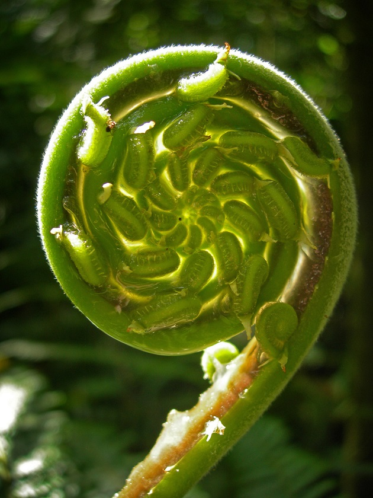
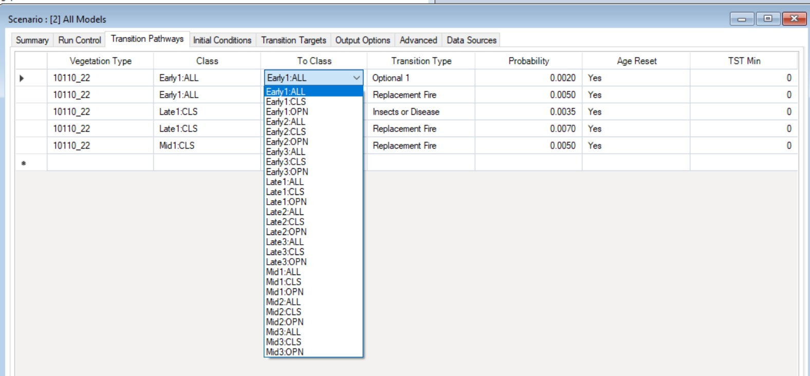
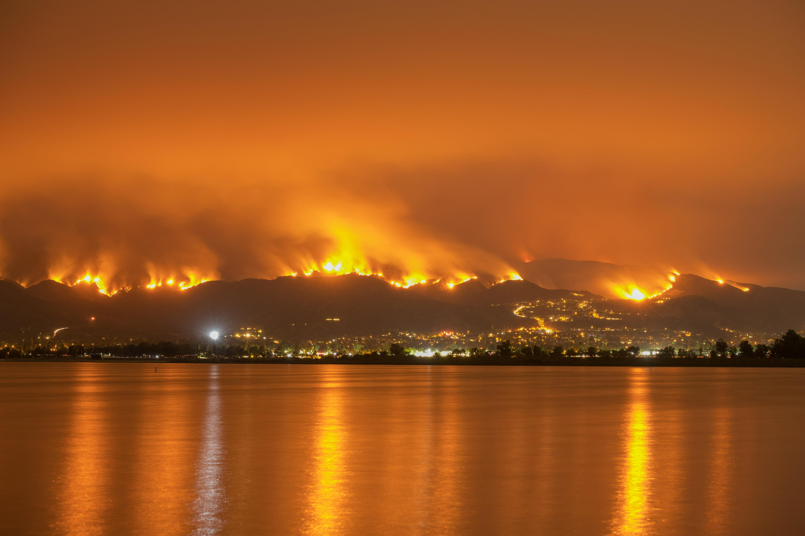
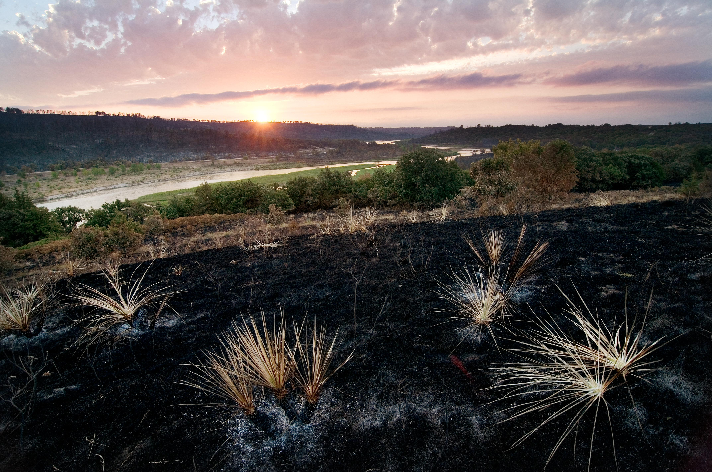

***

### This page:
+ Context about climate change and ecosystem impacts
+ Ways that BpS models can enhance understanding of potential responses of ecosystems  to climate change
+ Examples of how to alter disturbances and states to explore potential climate change impacts in the BpS modeling framework

***

## Climate Change and STSM Modeling

The goal of this section is to help you identify questions that the LANDFIRE BpS models (with their built-in simplifications, strengths, and constraints) are best suited to help you explore.

### Background 
Directional changes in climate factors, such as increases in minimum or maximum temperatures, changes in precipitation patterns, and increases in evaporation and transpiration rates, are influencing vegetation dynamics through many mechanisms operating at a range of scales, from genes to biomes. Observed ecological responses, in addition to ecological theory, allow us to generate hypotheses on how these changes may play out. There are many different aspects of climate change that you can productively explore with BpS models in the SyncroSim platform.

```{=html}
<style type="text/css">
  .figure {
    float: right;
    width: 95%;
    padding: 10px;
    text-align: center;
  }
</style>
```

```{r, echo=FALSE, fig.cap="Photo: © Marcie Eggers, TNC. Close-up of fern about to spring open in the Atlantic Forest rainforest, Guaraquecaba, Brazil"} 


```

Climate drivers like **temperature** and **moisture availability** play critical roles in shaping the life history of plants and associated species in terrestrial ecosystems. As the accumulation of greenhouse gasses and other anthropogenic factors have accelerated the rate of climate change, we are seeing a wide array of responses in plants, and other species like insect pests that can strongly influence vegetation dynamics.

The most frequently documented responses to climate change include changes in phenology (the timing of seasonal events, such as budburst), spatial shifts in range boundaries, and shifts in density patterns within a species’ range due to changes in recruitment or mortality.

Over evolutionary time, species have developed traits that reflect the influence of climate, other abiotic factors, and species interactions such as competition for resources. The suite of species that make up an ecosystem are likely to respond differently to climate change, leading to shifts in plant community composition.

<br>

<style>
div.blue { background-color:#cde6c8; border-radius: 5px; padding: 20px;}
</style>
<div class = "blue">
Notably for applications with BpS models, **changes in climate are influencing disturbance regimes**. For example:

1.	Increased temperature, with or without a decrease in precipitation, can lead to increased evaporative demand, and higher drought risk.  Drought tends to lengthen fire seasons and increase fire intensity.
2.	Higher temperatures (or stronger temperature gradients) can increase the intensity and dominant direction of wind, and probability of severe storms (i.e. hurricanes).
3.	Increasing temperatures strongly affect poikilothermic (cold-blooded) species like insect pests, contributing to increased growth rates and higher population sizes (more generations per year). 


</div>
<br>

## Climate change and BpS models

As described on the [Vegetation Modeling](./VegetationModeling.html){target='blank'} page, LANDFIRE BpS models are comprised of a set of **states** and **transitions**. Each state is a recognizable seral stage or “condition” of a particular vegetation type, and these states are linked by **deterministic transitions** (usually representing growth towards an older, taller age class), and stochastic transitions representing disturbances such as fire (with an associated probability of transition to a new state), windthrow, “weather stress” such as drought, insect outbreaks, etc. These transitions describe how one vegetation state changes to a different state. 

The “sweet spot” for LANDFIRE BpS models in a climate change context is exploring **how climate change can influence disturbance regimes**, and as a result **influence the relative proportion of each ecosystem state over time**. These tools allow users to consider the influence of processes that occur across a wide range of frequencies, including those that play out over time periods much longer than human experience. By iterating through a series of models with different parameter settings, you can [illuminate](./Perspectives.html){target='blank'} how climate-linked events with a range of different frequencies can interact to shape the distribution of vegetation classes on the landscape, and gain an understanding of the sensitivity of these patterns to observed and projected changes.  

For example, in the **Inter-Mountain Basins Montane Sagebrush Steppe BpS**, the dominant species is mountain big sagebrush. Wildfire and drought are typical disturbances in this ecosystem, as indicated by the transition icons above and below the states in the model shown below.  

Exploring climate change impacts may involve modifying the disturbance frequencies in a systematic way, following the current model structure. You might increase the rate of drought by increasing the drought probability value for the two drought transitions shown along the top. 

Reading the BpS model description can provide important background on ranges from the literature that can form the basis for these explorations, as there may be variation across locations that provides a starting point for selecting higher values that are still observed in the field. You can always build a model that goes outside of the currently observed range of disturbance rates, and it is likely that these rates will be exceeded as climate continues to change.  However, as values become more extreme, the probability that the overall system might change tend to increase – for example, one or more seral stages might show a major transition to a different type if fire or drought frequencies show a major increase. In the slides below, we illustrate a simple set of simulations where we double the frequency of drought, then double the frequency of fires, and then run a model where we double the rate both disturbances. The details on how to change this transition values are described on the [Modeling Work](./ModelingWork.html){target='blank'} page. 


<br>
<center>
Click through the slides below to explore ways you might explore climate change impacts in a sagebrush-steppe ecosystem:
```{r echo=FALSE, message=FALSE, warning=FALSE}

htmltools::tags$iframe(title = "My embedded document", src = "climateChangeSlick2.html", frameborder = "0", width = "100%", height="450")
```

</center>

You will notice in the plot of drought frequency, the probability of drought stays the same every year – each pixel is hit by drought based on this mean value.  Typically, drought regimes show high variation across years, with patterns tending to be synchronized across large areas. In a next iteration of models, you could work in the “advanced” mode to incorporate observed drought frequencies, and then increase those using a temporal multiplier.  Information on the sensitivity of the dominant species (Mountain big sagebrush) across its current range can help users frame this type of model modifications. 

In other vegetation classes with a more diverse set of co-dominant species, such as mixed hardwood forests of the southern Appalachians, the transition within LANDFIRE BpS models represent an average across multiple species.  This does not mean that you can’t gain insight by exploring climate change drivers with these models, but it is important to remember that different species are likely to respond to climate drivers in unique ways. 

## Reviewing the tools
In the section below, we briefly review the windows in SyncroSim where you make basic changes to BpS models.

### Altering disturbances
```{r, echo=FALSE, out.width='30%', out.extra='style="float:right; padding:10px"'} 
knitr::include_graphics("images/disturbance.jpg")

```

* Adding or removing a type of disturbance. Note there is not a specific “drought” factor, so it can be captured under “Wind or Weather or Stress.”
* Modifying the intensity, or distribution across intensity levels (e.g., low, med, high)
* Changing the rate (probability) directly 
* Incorporating a rate multiplier, which allows the probability of a disturbance to change over time. 


<br>

### Altering states
```{r, echo=FALSE, out.width='75%', out.extra='style="float:right; padding:10px"'} 


```

* Adding or removing vegetation classes (i.e., adding a new grass-dominated state that might be expected if fire frequencies in a forest or shrubland become very high, or adding an invasive plant species that is favored by some aspect of climate change)
* Slowing down or speeding up succession to represent a change in growth rates, or slower recovery
* Transitioning a vegetation class to a new BpS


<br>

## Additional Examples

### More intense fires
Increases in the intensity of fires is a trend that has been observed in forests with high vegetation density, often in combination with drought. To represent this process, you would increase the probability of high intensity fires in your model – or potentially add this type of disturbance if it was not already in the model.

<center>
```{r, echo=FALSE, out.width= "70%"} 


```
</center>
<br>
<center>
Photo: © Ben Jiang, TNC. One of the 2018 California wildfires.
</center>
<br>

### Longer fire seasons

* [Cattau et al. 2020](https://doi.org/10.1111/geb.13058){target='blank'} examine the extension of the duration of the fire season due to climate change both by natural ignition sources and human-caused fires. This would involve decreasing the fire return interval (i.e., increasing the probability) within this modeling platform. 

<center>
```{r, echo=FALSE, out.width= "70%"} 


```
</center>
<br>
<center>
Photo: © Chris Helzer, TNC. Niobrara River near the headquarters of The Nature Conservancy's Nebraska Niobrara Valley Preserve after the 2012 wildfire.
</center>

<br>
<br>


```{=html}
<style type="text/css">
  .figure {
    float: right;
    width: 35%;
    padding: 10px;
    text-align: center;
  }
</style>
```

```{r, echo=FALSE, fig.cap="Photo: © Stavros Mitchelides, TNC Photo Contest 2019. Dense wildfire smoke in Banff National Park."} 


```


### Larger fires

Similarly, as climate continues to change we are seeing an increase in the spatial extent of fires.  In the aspatial LANDFIRE BpS models, you can simulate this in the same way as you would model an increase in fire frequency – by using a higher fire frequency value. As a result of using the same approach for both patterns (larger fires, and more frequent fires), it is not possible to separate out impacts in the aspatial models. With spatial models, you can add this additional complexity.

<br>

### Insect outbreaks
Insect outbreaks that promote a state change in vegetation are not found in all of the “out of the box” BpS models, but the option to add this transition is available. For example, insect outbreaks can be added and varied in all of the ways described above for fire. Adding a separate insect outbreak component may be highly relevant, especially if there is evidence to support impacts that are independent of other drivers. In the case of drought-stressed trees contributing to high tree mortality, understanding variations in drought risk, for example associated with topography or soil water holding capacity, may allow you to partition out impacts by site conditions.
 

## Transitions in vegetation classes


```{=html}
<style type="text/css">
  .figure {
    float: right;
    width: 65%;
    padding: 10px;
    text-align: center;
  }
</style>
```

```{r, echo=FALSE, out.width='65%', fig.cap=" Photo: © Devan King/TNC"} 
knitr::include_graphics("images/soil.jpg")

```


In some vegetation systems, managers have observed that increases in the intensity or extent of fires is leading to a failure of the ecological system to regenerate – reasons may include a loss of organic soil horizons in the intense fire, or a lack of seed sources close to the newly burned area. This observation could be modeled by adding a new vegetation class (perhaps a grass or shrub class), then transitioning some (using the proportion field) or all of the burned cells to this new class.

While BpS models are [aspatial](./advancedModeling.html){target='blank'} as delivered, you can capture that variation by developing separate iterations of the same model if you have information on how vegetation dynamics might vary within an assessment area. For example, topographic factors or soil moisture may strongly influence the sensitivity of a system to a disturbance, the rate of recovery after a disturbance, or the probability that a disturbance will shift a vegetation type to a new class.

## Increasing model complexity 
Changes in climate factors can influence ecosystems in multiple ways, with some drivers potentially interacting with each other. While climate change impacts are complex, this does not mean you should try to capture the full range of complexity in your model, especially not all in the first steps of model exploration For example, the interaction between drought, insect outbreaks, and fire is an example of a multi-factor, climate-related driver of change in forested ecosystem, especially notable now in the western U.S. You could take an existing BpS model and add or modify drought, fire, and insect probabilities if these three drivers tend to operate together. However we suggest at least starting your modeling work by treating this complex of drivers as one disturbance, potentially starting with the one for which you have the best information.

## BpS model limitations in a climate context 
In the section above, we point out the challenge of separating out impacts of increasing fire size, and increasing fire frequency – this is not feasible with an aspatial model. As delivered, patterns of drought (included as weather stress) are also not capturing temporal variability and spatial correlation, though you can address some of these issues with advanced settings. 

Similarly, because BpS models operate at the ecological level of vegetation communities, species-level responses are not well addressed in most models. Due to this focus on vegetation classes, and the fact that they are aspatial, LANDFIRE BpS models need to be modified if evaluating species range shifts. 

Further, if you are interested in exploring vegetation responses within what the BpS models consider a “state” – for example, exploring changes in species composition that might occur as a result of changes in tree competitive ability as growing seasons lengthen due to a warming climate, BpS models are likely not the best hammer for that nail! As with modifying any model, it’s important to consider the original intent and structure, and work within those constraints. 


***

#### What's next?
+ explore [3 real-life model examples](./Examples.html){target='blank'} that have undergone scrutiny and analysis by the LANDFIRE team
+ learn the intricacies of examining each model description