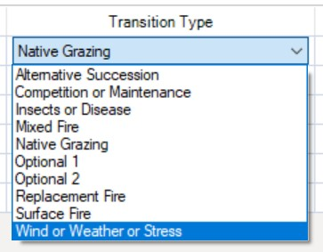

##  GETTING IT TO WORK FROM https://blog.rstudio.com/2021/04/20/knitr-fig-alt/

```{r}

library(palmerpenguins)
library(ggplot2)
```


```{r fig.cap="Bigger flippers, bigger bills", fig.alt = "Scatterplot of flipper length by bill length of 3 penguin species, where we show penguins with bigger flippers have bigger bills."}
ggplot(data = penguins, aes(x = flipper_length_mm,
                            y = bill_length_mm,
                            color = species)) +
  geom_point(aes(shape = species), alpha = 0.8) +
  scale_color_manual(values = c("darkorange","purple","cyan4")) 
```


***

### This page:
+ Context about climate change and ecosystem impacts
+ Ways that BpS models can enhance understanding of potential responses of ecosystems  to climate change
+ Examples of how to alter disturbances and states to explore potential climate change impacts in the BpS modeling framework

***

## Climate Change and STSM Modeling

The goal of this section is to help you identify questions that the LANDFIRE BpS models (with their built-in simplifications, strengths, and constraints) are best suited to help you explore.

### Background 


```{r, echo=FALSE, out.width= "100px", out.extra='style="float:right; padding:10px"',  fig.alt = "curled up fern about to open", fig.cap="Photo: © Marcie Eggers, TNC. Close-up of fern  \nabout to spring open in the  Atlantic Forest rainforest,  \nGuaraquecaba, Brazil"} 
knitr::include_graphics("fern.jpg")

```


Changes in climate, such as increases in temperature, changes in precipitation patterns, and increases in evaporative demand are influencing vegetation dynamics through many mechanisms operating at a range of scales, from genes to biomes. Observed ecological responses such as species range shifts, and changes in growth and mortality, in addition to ecological theory, allow us to generate hypotheses on how these changes may influence large-scale vegetation patterns. Many of these hypotheses can be productively explored with BpS models in the SyncroSim platform.

Before jumping into modeling, it is important to recognize that BpS models focus on vegetation communities, which presents some limitations in a climate change modeling context. Over evolutionary time, plant species have developed traits that reflect the influence of climate, other abiotic factors, and species interactions such as competition for resources. The suite of species that make up an ecosystem are likely to respond differently to climate change. While growth and mortality transitions for vegetation classes can easily be modified with these models, questions that focus on changes in species dynamics or changes in composition within a vegetation class, are more appropriate for species-focused models. 


<br>
<br>
<br>


<style>
div.blue { background-color:#cde6c8; border-radius: 5px; padding: 20px;}
</style>
<div class = "blue">
The “sweet spot” for LANDFIRE BpS models in a climate change context is exploring **how climate change can influence disturbance regimes**, and as a result **influence the relative proportion of each ecosystem state over time**. These tools allow users to consider the influence of processes that occur across a wide range of frequencies, including time periods much longer than human experience. By iterating through a series of models with different  settings, you can [illuminate](./Perspectives.html){target='blank'} how climate-linked events with different frequencies can interact to shape the distribution of vegetation classes on the landscape, and gain an understanding of the sensitivity of these patterns to observed and projected climate-related changes. 


</div>
<br>

## Climate change and BpS models

As described on the [Vegetation Modeling](./VegetationModeling.html){target='blank'} page, LANDFIRE BpS models are comprised of a set of **states** and **transitions**. Each state is a recognizable seral stage or “condition” of a particular vegetation type, and these states are linked by **deterministic transitions** (usually representing growth towards an older, taller age class), and stochastic transitions representing disturbances such as fire, windthrow, and “weather stress” which can be used to represent drought, insect outbreaks, and other factors. These transitions describe how one vegetation state changes to a different state, and while the default values represent historic reference conditions, you can update them to represent current and future climates. Using the **Inter-Mountain Basins Montane Sagebrush Steppe BpS** as an example, a first step might be to just explore what happens to model outputs when you change the disturbance rates. Wildfire and drought are typical disturbances in this ecosystem, as indicated by the transition icons above and below the states in the model shown below.  

Exploring climate change impacts may involve modifying the disturbance frequencies in a systematic way, following the current model structure. You might increase the rate of drought by increasing the drought probability value for the two drought transitions shown along the top. 

Reading the BpS model description can provide important background on ranges from the literature that can form the basis for these explorations, as there may be variation across locations that provides a starting point for developing a range of values to compare. . You can always build a model that goes outside of the currently observed range of disturbance rates as a way of exploring what might happen as climate continues to change. However, as values become more extreme, note that you are getting into a zone of higher and higher model uncertainty; in the real world the probability that the overall system might change will likely increase. For example, if fire frequencies become very high, one or more seral stages may transition to a different kind of vegetation. In the slides below, we illustrate a simple set of simulations where we double the frequency of drought, then double the frequency of fires, and then run a model where we double the rate both disturbances. The details on how to change these transition values are described on the [Modeling Work](./ModelingWork.html){target='blank'} page. 


<br>
<center>
Click through the slides below to explore ways you might explore climate change impacts in a sagebrush-steppe ecosystem:
```{r echo=FALSE, message=FALSE, warning=FALSE, fig.cap="Slideshow – stay tuned"}

htmltools::tags$iframe(title = "My embedded document", src = "climateChangeSlick2.html", frameborder = "0", width = "100%", height="450")
```

</center>

You will notice in the plot of drought frequency that the probability of drought stays the same every year – each pixel has the same “odds” of being hit by drought based on this mean value. Drought conditions typically show high variation across years, with occurrences synchronized across large areas. To produce a more realistic model, you could work in the “advanced” mode to incorporate a variable pattern of drought frequencies, and then increase the rates using a temporal multiplier. 

For this example, information on the drought and fire sensitivity of the dominant species, Mountain big sagebrush, from across its current range could help you frame these types of model modifications In BpS models with a more diverse set of co-dominant species, such as mixed hardwood forests of the southern Appalachians, the transition rates and time steps represent an average across multiple species in the vegetation community. This does not mean that you can’t gain insight by exploring climate change drivers with these models, but it is important to remember that different species are likely to respond to climate drivers in unique ways. 

## Reviewing the tools
In the section below, we briefly review the windows in SyncroSim where you make basic changes to BpS models.

### Altering disturbances

<div style="float:right; padding:10px">
```{r, echo=FALSE, out.width='30%',  fig.alt=="Screenshot of a dropdown menu titled Transition type with the following options: Native grazing, alternative succession, competition or maintenance, insects of disease, mixed fire, native grazing, Optional 1, Optional 2, replacement fire, surface fire, wind or weather stress", fig.cap="TESTING TESTING A CAPTION"} 


```
</div>


* Adding or removing a type of disturbance. Note there is not a specific “drought” factor, so it can be captured under “Wind or Weather or Stress.”
* Modifying the intensity, or distribution across intensity levels (e.g., low, med, high)
* Changing the rate (probability) directly 
* Incorporating a rate multiplier, which allows the probability of a disturbance to change over time. 


<br>
