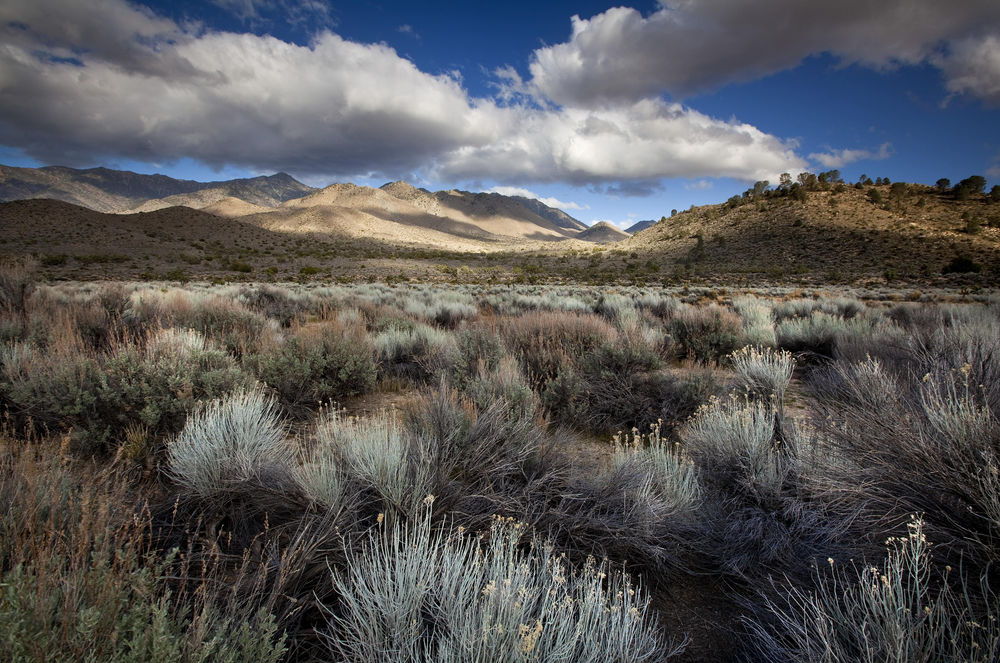
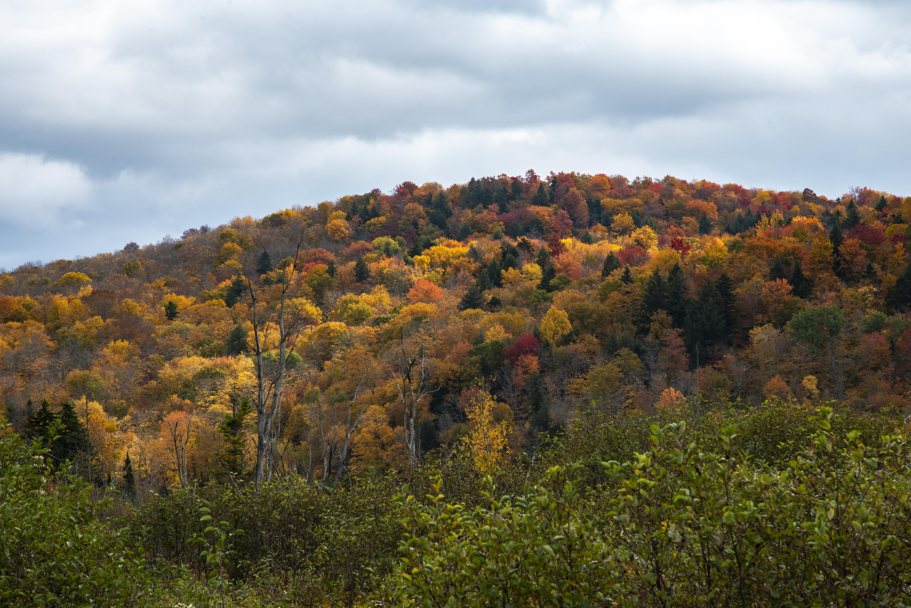
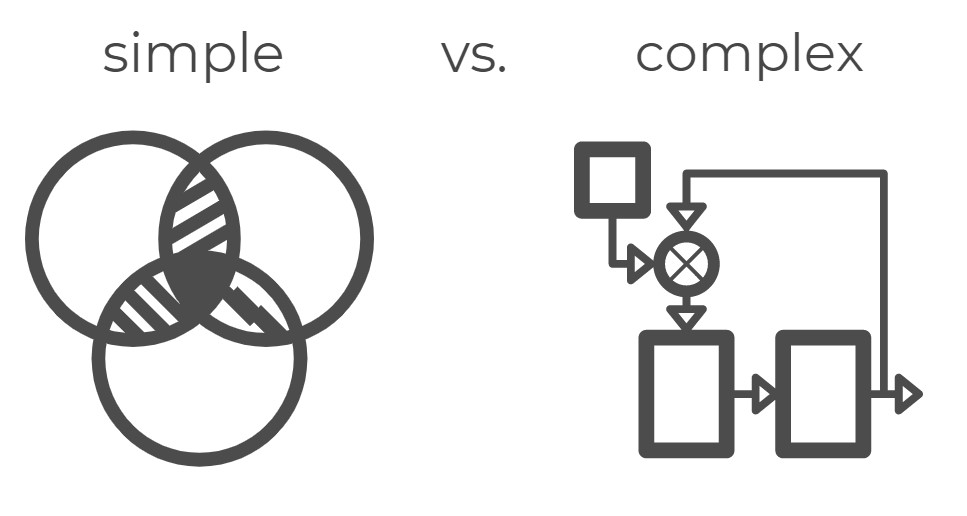
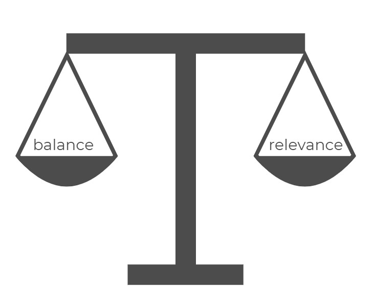
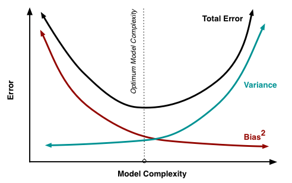

## Welcome

Hello and welcome to The Nature Conservancy's LANDFIRE vegetation dynamics modeling site. We created this site to help you harness the potential of the vegetation dynamics modeling framework to accomplish your analysis, management, and restoration objectives. We recognize the importance of having the best resources to accomplish your goals and LANDFIRE is continually improving our products to get you the tools and data that you need.
<br>

**How to use this website?** We designed this website as a resource for both new and seasoned Biophysical Setting (BpS) modelers. We use the Montane Sage-Steppe ecosystem model throughout the website. By weaving this model into all the tutorials, we can dive deeper into exploring, modifying, and understanding the model’s “story”. We hope you find our website useful and most importantly, we hope you use these BpS models to their fullest extent. 

If you are already familiar with this modeling framework and ready to get started, skip ahead to [Modeling Work](./ModelingWork.html){target='blank'}.


```{=html}
<style type="text/css">
  .figure {
    float: right;
    width: 55%;
    padding: 10px;
    text-align: center;
  }
</style>
```


```{r, echo=FALSE, fig.cap="Landscape picture of sagebrush, clouds and brown hills in the background"} 


```
<br>

Photo: © Ian Shive, TNC. Sierra Mountain Foothills, Mojave Desert, Central California

## Why integrate this into your current work?

This framework provides a national baseline for assessing current vegetation conditions while accounting for historical ecology. Integrating this knowledge with current projections of climate and other factors has the potential to improve the way we manage land while providing ecological context. 

>This modeling framework can help you make projections about
future landscape conditions as management and natural environments evolve. When used within the intended context, BpS modeling can be a powerful tool for managers. 

Biophysical models help users investigate the effects from (simulated) ecosystem disturbances, and learn how changes in management actions might impact an ecosystem before allocating time or resources to on the ground operations


<center>
```{r, echo=FALSE, out.width= "75%", fig.cap="Hillside full of very tightly spaced orange, yellow, green leafed trees with tall brush in the foreground"} 


```
</center>
<br>
<center>
Photo: © Eamon Mac Mahon, TNC, Autumn foliage near Burnt Mountain, Vermont.
</center>
<br>

## What will you learn?

1. We demonstrate the flexible software environment, [SyncroSim](https://syncrosim.com/){target='blank'} which allows users to explore and manipulate LANDFIRE's vegetation dynamics models

2. We illustrate how LANDFIRE’s vegetation dynamics models can be used to investigate historical vegetation dynamics and use these historical models to jumpstart your exploration into current and possible future landscape conditions in your area of interest

3. We explore options for modifying vegetation models to represent current or projected future landscape conditions

4. We introduce techniques for that simulate impacts from climate change in the LANDFIRE vegetation models


## New to modeling? Consider this...


Models are everywhere, they may be behind the scenes or in full view. Some common examples of models:

```{=html}
<style type="text/css">
  .figure {
    float: right;
    width: 65%;
    padding: 10px;
    text-align: center;
  }
</style>
```


```{r, echo=FALSE, fig.cap="Picture of a man holding a model airplane about ready to launch it with a rock in the background "} 


```

Photo: © Chris Leipelt


+ weather forecasts
+ measuring the state of the economy
+ assessing the condition of a landscape 
+ forecasting a pandemic
+ maps

<br>
Regardless of their complexity, all models are by definition a simplification of reality. Like the model airplane - it “flies” like an airplane but it cannot carry cargo or passengers.

<br>
<br>

<center>
```{r, echo=FALSE, out.width= "45%", fig.cap="Figure depicting the difference between a simple vs. Complex model: simple image is a basic venn diagram with 3 circles – overlapping in the middle. Second picture has three boxes, one circle with arrows coming in and out of the elements depicting a complex model"} 


```
</center>
<br>

>"All models are wrong, so why do we create and use them?" - George Box

<br>
We create and use models because (as Box _also_ said) they can be useful. Models can illuminate through prediction or explanation. They can promote understanding and exploration if used properly. 

**Balance and relevance** are what can make a model illuminating.

<center>
```{r, echo=FALSE, out.width= "45%", fig.cap="Figure: a scale with a double pan with the word balance in one pan and relevance in the other pan – words are equally weighted and balanced"} 


```
</center>
<br>

## Developers vs Users: Key Considerations

For the model developer, the key is to balance **precision and bias** of the outputs with the relevance of the model. The goal is to hit your application sweet spot.

<br>

<center>

```{r, echo=FALSE, out.width= "55%", fig.cap="Graph with error on the Y axis, model complexity on the x axis, a vertical line emerges in the middle of the x axis depicting the optimum model complexity target where the y axis elements (total error, variance and bias) intersect with this optimum model complexity target"} 


```

</center>
<center>
Image courtesy: [Francesco Pochetti](francescopochetti.com){target='blank'}
</center>
<br>

The model should provide useful information but must also function for the user (i.e. have the right level of complexity). Complexity should have a purpose: to provide more refined information, or in some cases provide the same information with more fidelity. 

### Complex models

+ typically require more input information
+ are more difficult to develop and de-bug
+ take longer to run 

>[LANDFIRE BpS models](./VegetationModeling.html){target='blank'}, with their limited number of states and transitions, are less complex and provide relatively few and coarser level outputs. This also makes them easier to create and use. 

Models such as [SIMPPLLE](https://www.fs.usda.gov/treesearch/pubs/40241){target='blank'} and [LANDIS II](http://www.landis-ii.org/){target='blank'} sit nearer the middle or upper end of the complexity scale and can provide more types of outputs but at higher operational cost.

<br>

### Understanding model characterstics
<br>
<style>
div.blue {background-color:#e6f0ff; border-radius: 5px; padding: 20px;}
</style>
<div class = "blue">
- What factors/inputs are included?
- What factors/inputs are _not_ included? 
- Can you provide the inputs at the level of accuracy required? 
- What modeling technique was used? 
- How was the model intended to be applied? 
- What is the “scale” of the model?
</div>
<br>

### Advice for using BpS models

1. Adhere to established modeling standards.

2. Have a goal and a plan. Don’t just wing it!

3. Work through the model changes in a stepwise fashion. Add states and transitions one at a time.

4. Review the results and plan the next steps.

5. Keep it simple. The number of states directly impacts the number of transitions you need and the amount of information you need to support the model. As the model becomes more complicated it becomes more difficult to create, parametrize, understand, modify and utilize appropriately.

6. Expect the unexpected. If you knew the answer with certainty, you probably did not need the model. An answer that seems strange to you may be correct, and indeed illuminating.

***

#### What's next?
+ learn what a [state-and-transition model](./VegetationModeling.html){target='blank'} (STSM) is
+ learn how 900 LANDFIRE STSMs were built and how to use them with SyncroSim
+ get acquainted with biophysical settings 

<center> 
<br>

 <font size="4"> This website was developed by [The Nature Conservancy LANDFIRE Team](https://www.conservationgateway.org/ConservationPractices/FireLandscapes/LANDFIRE/contacts/Pages/default.aspx){target='blank'} under Agreement G18AC00378 with the U.S. Geological Survey.</font> 
 </center> 
 
 <div class="tocify-extend-page" data-unique="tocify-extend-page" style="height: 0;"></div>
 