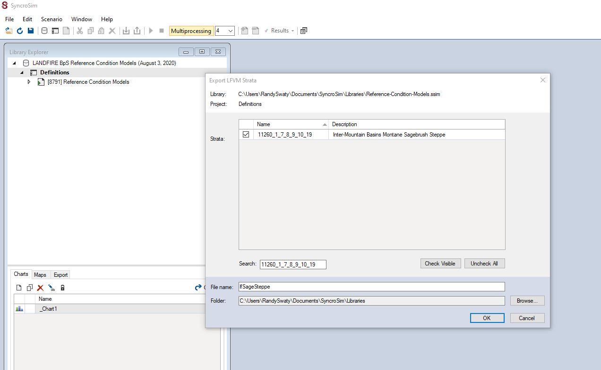

<style>
body {
    font-family: Georgia,"Times New Roman",Times,serif;
    font-size: 15px;
    line-height: 1.42857143;
    color: #000000;
    background-color: #ffffff;
}
</style>

<style>
.list-group-item.active, .list-group-item.active:focus, .list-group-item.active:hover {
    background-color: darkseagreen;
}
</style>
---

### This page:
1. Load the LANDFIRE BpS Reference Condition Models library
2. Make a new library with one Biophysical Setting.

While we are focused on the sage-brush steppe, and introducing transitions you might not have on your landscape, these basic tasks will apply to almost all modeling efforts.

In this document the ">" sign will be analogous to "then click", meaning a single left mouse click unless otherwise noted.

### Load the LANDFIRE BpS Reference Condition Models library

Within SyncroSim there are 3 main levels of organization: 1) libraries, 2) projects and 3) scenarios.  Most of your work will be at the scenario level, but first we have to load the LANDFIRE BpS Reference Condition Models (May 28, 2020) into the SyncroSim software.  To do this you will:

1. Open SyncroSim
2. Click File (top left) > New Library... (near the top) > landfirevegmodels (upper middle) > Reference Models > OK
3. Pour a beverage and wait. You are downloading the library that contains nearly 1,000 vegetation models.  It may take a while.
4. Once complete you will see the library in the Library Explorer pane.

### Create a new library with the Sage Steppe BpS model scenario

The LANDFIRE BpS Reference Condition Models library is the master library with all of the LANDFIRE BpS models for the entire country.  Unless you are doing something like testing fire suppression for every BpS in the country or something similar you will want to create a new library with only the BpSs you are interested in.  

To create the new library you will:

1. Highlight the Project (e.g., word "Definitions") of the "LANDFIRE BpS Reference Condition Models (there will be a date here)" Library.
2. Go to Edit -> Export LFVM Strata 
3. Select the BpS(s) of interest.  For this exercise you can paste "11260_1_7_8_9_10_19" into the Search box.  Note, you could also type in words such as "sage" and/or "steppe".  Check the box(es) of the BpSs you want to export to your new SyncroSim library.
4. In the "File Name" box type the desired name of the new library, e.g., "lfSageSteppe".
5. Browse to the folder where you would like the new library to live.
6. Hit OK.  It takes a little time to make the new library. 

<center>
```{r, echo=FALSE, out.width= "100%"} 


```
</center>
<br>
<center>
Screenshot of Inter-Mountain Basins Montane Sagebrush Steppe Export LFVM Strata
</center>

<br>

NICE. You now have a library with just one BpS in it.  


