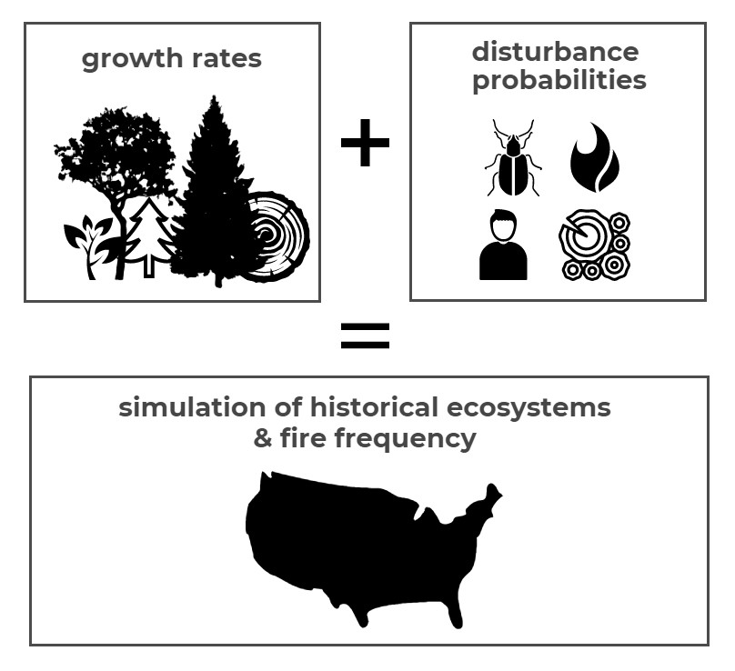

### This page:
+ Introduction to state-and-transition simulation models (STSM)
+ Explanation of LANDFIRE biophysical settings (BpS) models
+ Example of an STSM  
+ Getting started with [SyncroSim](https://syncrosim.com/){target='blank'}

### State-and-transition models

A **state-and-transition model** (STM) conceptualizes vegetation in terms of discrete states and the transitions or pathways between them [(Westoby 1989)](http://rangelandarchive.ucdavis.edu/files/187350.pdf){target='blank'}. States are often used to represent discrete development (seral) stages, and transitions may represent disturbances such as hurricanes, fire, or grazing, but can also represent management actions such as thinning, livestock management, or herbicide application. Conceptual state-and-transition models, called [Environmental Site Descriptions](https://www.nrcs.usda.gov/wps/portal/nrcs/main/national/technical/ecoscience/desc/){target='blank'} (ESDs), have been developed through an inter-agency partnership and widely used to monitor, evaluate, and manage rangelands.

### State-and-transition _simulation_ model

When a STM is built in a software environment with rates of growth between states and probabilities for each transition, it is known as a **state-and-transition simulation model** (STSM; [Daniel et al. 2016](https://besjournals.onlinelibrary.wiley.com/doi/pdf/10.1111/2041-210X.12597){target='blank'}). A STSM can be used to **simulate the dynamics of a system over time and space.** STSMs have been widely applied in natural resource management to estimate historical conditions ([Donato et al. 2020](https://esajournals.onlinelibrary.wiley.com/doi/epdf/10.1002/eap.2013){target='blank'}, [Blankenship et al. 2012](https://www.fs.fed.us/pnw/pubs/pnw_gtr869/pnw_gtr869_004.pdf){target='blank'}), simulate the spread of invasive species ([Jarnevich et al. 2019](https://esajournals.onlinelibrary.wiley.com/doi/full/10.1002/ecs2.2730){target='blank'}), test various management scenarios ([Low et al. 2010](https://www.conservationgateway.org/Documents/Enhanced%20conservation%20action%20planning_assessing%20landscape%20condition.pdf){target='blank'}, [Costanza et al. 2015a](https://www.aimspress.com/article/10.3934/environsci.2015.2.180){target='blank'}), and forecast future landscape conditions under different climates ([Provencher et al. 2016](https://www.springer.com/gp/book/9783319249285){target='blank'}, [Swearingen et al. 2015](https://www.aimspress.com/fileOther/PDF/environmental/201503737.pdf){target='blank'}, [Costanza et al. 2015b](https://www.sciencedirect.com/science/article/pii/S0301479714006112){target='blank'}). 

<br>
Click through the example below to see how a STSM works:
<center>
```{r echo=FALSE, message=FALSE, warning=FALSE}

htmltools::tags$iframe(title = "My embedded document", src = "kbslick5.html", frameborder = "0", width = "100%", height="450")
```

</center>

### LANDFIRE BpS models: a complete set for the U.S.

<style>
div.blue { background-color:#cde6c8; border-radius: 5px; padding: 20px;}
</style>
<div class = "blue">

The **[LANDFIRE](https://landfire.gov/){target='blank'}** Program, in collaboration with experts around the country, created a set of over 900 STSMs for ecosystems in the United States. Each LANDFIRE STSM represents a **Biophysical Setting** – a vegetation concept that describes the vegetation community likely to have been dominant on the landscape prior to European colonization of North America given an approximation of historical disturbance regimes and the current biophysical environment. 

**[LANDFIRE BpS models](https://www.landfire.gov/bps-models.php){target='blank'}** are reference condition models that define natural vegetation communities and their historical disturbance regimes. On the [modify](./modifyModel.html){target='blank'} page you will learn more about these models and how to modify them to represent current landscapes and simulate possible future conditions.
</div>
<br>

### SyncroSim software

LANDFIRE currently uses [SyncroSim](http://docs.syncrosim.com/){target='blank'} and its [ST-Sim package](http://docs.stsim.net/){target='blank'} as the modeling platform to develop and deliver its STSMs. SyncroSim is available for free and is the latest in a series of related STSM software packages including Path and the [Vegetation Dynamics Development Tool](https://essa.com/explore-essa/tools/vddt/){target='blank'} (VDDT). SyncroSim is a flexible platform designed to manage data for simulation modeling. Packages developed for SyncroSim can be used for any kind of simulation model with structured input and output data.  ST-Sim is a SyncroSim package for State-and-Transition Simulation Modeling. ST-Sim can be used to model vegetation, land use and land cover change for virtually any kind of ecosystem and landscape. The model is stochastic (randomly determined) and can be run either spatially or non-spatially. While LANDFIRE BpS models are non-spatial, there are many examples of spatial STSMs (see [Daniel and Frid 2011](https://www.fs.fed.us/pnw/pubs/pnw_gtr869/pnw_gtr869_002.pdf){target = 'blank'}.  We recommend that users read the [overview of SyncroSim](http://docs.syncrosim.com/getting_started/overview.html){target='blank'} and follow the steps below for downloading Syncrosim and St-Sim.

To assist modelers use LANDFIRE Biophysical Settings models the "lfvegmodels" package is under development, to be fully implemented within the SyncroSim software by the of September, 2020.

#### Step 1: Download SyncroSim: 
+ available here: [SyncroSim software](https://syncrosim.com/){target='blank'}
Make sure you download the full package (SyncroSim-setup.exe - check your downloads file. Note - SyncroSim is _not_ the same as SyncroSim Lite)

#### Step 2: Install required packages (**do not skip this step**):
To work through this tutorial you will need to load 2 packages: 1) St-Sim and 2) landfirevegmodels.   

In SyncroSim, navigate to 'File' -> 'Packages' -> select 'ST-Sim state-and-transition model' and 2020 'lfvegmodels')-> 'Install' -> OK (see screenshot below).

<center>
```{r, echo=FALSE, out.width= "85%"} 
knitr::include_graphics("images/packages.JPG")

```
</center>
<br>


### Review
State-and-transition simulation models use inputs such as the rates of change and the probabilities of disturbance to simulate the dynamics of ecosystems. Using SyncroSim software users can build, modify, and run STSMs to explore landscape change over time and space.

<center>
```{r, echo=FALSE, out.width= "55%"} 


```
</center>

See [References](./References.html){target='blank'} for full reference list

***

#### What's next?
+ understanding the [characteristics of the model](./perspectives.html){target='blank'} and taking a bird's eye view when considering the BpS model approach
